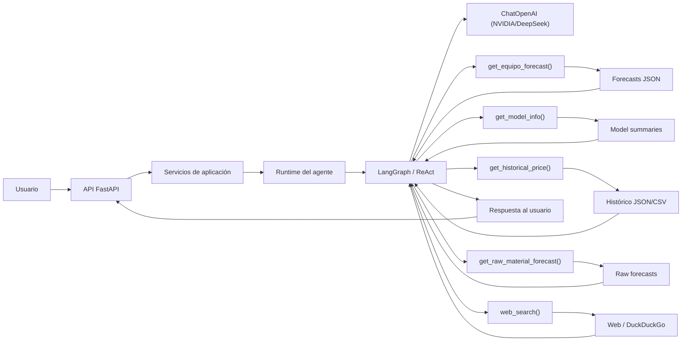
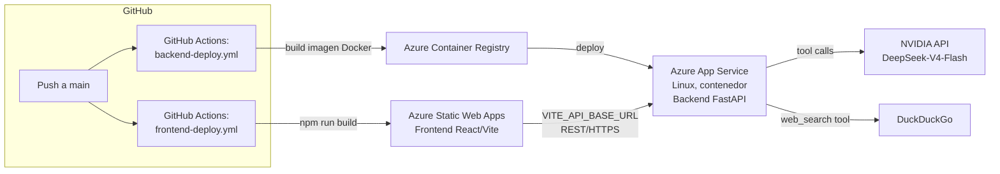

# Cost Forecast Agent — Documentación Técnica

> Prueba técnica: agente conversacional (LangGraph + DeepSeek vía NVIDIA API) sobre
> modelos de pronóstico de costos de equipos, expuesto vía API REST (FastAPI) y
> consumido por un frontend React, con arquitectura preparada para despliegue en Azure.


---

## 1. Resumen del proyecto

| | |
|---|---|
| **Backend** | FastAPI (Python 3.11), Clean Architecture, expone el agente LangGraph + endpoints de pronóstico/histórico como API REST |
| **Frontend** | React 18 + Vite, consumo vía Axios, gráficos con Recharts |
| **Agente de IA** | LangGraph (`create_react_agent`) + DeepSeek-V4-Flash vía API de NVIDIA, con memoria de conversación (encontrada gratis en la web)(`MemorySaver`) |
| **Contenedores** | Docker multi-stage para backend y frontend, con `docker-compose` |
| **CI/CD** | GitHub Actions: build + push a Azure Container Registry + deploy a Azure App Service (backend); build + deploy a Azure Static Web Apps (frontend) |
| **Estado de ejecución local** | ✅ Verificado (Dashboard, Forecast, Chat) |
| **Estado de despliegue en Azure** | ⚠️ Pipeline configurado y probado hasta el paso de despliegue; bloqueado por cuota de la suscripción de estudiante (sección 5) |

---

## 2. Arquitectura de software (backend)

El backend sigue **Clean Architecture**: las dependencias apuntan siempre hacia
adentro (hacia el dominio), nunca al revés.

```
backend/app/
├── domain/            # Entidades puras (dataclasses), sin dependencias externas
├── application/        # Casos de uso: orquestan domain + infrastructure
│   └── services/        (ForecastService, HistoricoService, ChatService)
├── infrastructure/      # Detalles técnicos, reemplazables sin tocar el resto
│   ├── agent/            → agente LangGraph (agent_langgraph.py, agent_runtime.py)
│   └── repositories/     → acceso a los JSON/CSV exportados por el notebook
├── api/                # Capa HTTP: traduce REST <-> casos de uso
│   ├── v1/routers/       (chat, forecast, models, historico, health)
│   ├── v1/schemas/       (Pydantic: validación/serialización)
│   └── deps.py           (inyección de dependencias)
├── exceptions/          # Excepciones de dominio + manejo centralizado de errores
└── main.py              # Entry point (FastAPI app, middlewares, wiring)
```

Permite que el agente de IA, los modelos de
pronóstico y el mecanismo de lectura de datos (hoy JSON/CSV) se puedan
reemplazar — por ejemplo, migrar a una base de datos o a Azure Blob Storage —
sin tocar la lógica de negocio (`application/`) ni los endpoints (`api/`).

### El agente conversacional

# Arquitectura del agente de IA

El agente fue desarrollado utilizando **LangGraph** bajo el paradigma **ReAct (Reasoning + Acting)**.

Su funcionamiento consiste en un ciclo iterativo donde el modelo:

1. Analiza la consulta del usuario.
2. Decide qué herramienta necesita utilizar.
3. Obtiene información real desde dicha herramienta.
4. Razona sobre los resultados obtenidos.
5. Construye una respuesta fundamentada.

Adicionalmente, el agente incorpora memoria conversacional, lo que le permite conservar el contexto entre diferentes preguntas y ofrecer respuestas más naturales durante una misma conversación.

## Arquitectura del sistema



---

# Herramientas disponibles

## 1. Pronóstico de precios de equipos

Permite consultar el pronóstico generado por el pipeline de predicción para cualquier fecha disponible del horizonte proyectado.

La información recuperada incluye:

* percentil 5;
* mediana;
* percentil 95.

El agente comunica la incertidumbre asociada a cada predicción mediante intervalos probabilísticos.

---

## 2. Información del modelo predictivo

Esta herramienta proporciona información sobre el modelo utilizado para cada equipo.

Incluye aspectos como:

* materias primas utilizadas como variables explicativas;
* coeficientes del modelo;
* métricas de desempeño;
* coeficiente de determinación (R²);
* errores obtenidos durante la validación temporal.

Permite que el agente no solo indique una predicción, sino que también pueda justificar la confiabilidad del modelo utilizado.

---

## 3. Consulta de datos históricos

El agente puede recuperar precios históricos tanto de los equipos como de las materias primas.

Cuando el usuario solicita intervalos extensos, la herramienta devuelve un resumen estadístico en lugar de todos los registros diarios. Esta decisión reduce el volumen de información procesada por el modelo, mejora la eficiencia de la conversación y evita consumir innecesariamente el contexto disponible del LLM.

---

## 4. Pronóstico de materias primas

Además del precio proyectado de los equipos, el agente tiene acceso al pronóstico individual de las materias primas **Price_Y** y **Price_Z**, incluyendo sus intervalos de confianza.

En esta solución también se entregan los pronósticos de las variables explicativas, permitiendo que el agente construya respuestas más interpretables, basadas en caidas o incrementos del precio en la materia prima.

---

## 5. Búsqueda web

El agente dispone de una herramienta de búsqueda web para consultar información reciente relacionada con materias primas, mercados, eventos económicos o factores geopolíticos.

Complementa la predicción cuantitativa con evidencia cualitativa proveniente de fuentes externas. Por ejemplo, si el modelo proyecta un incremento en una materia prima, el agente puede buscar noticias recientes sobre problemas de suministro, cambios en la demanda, conflictos internacionales o políticas económicas que ayuden a explicar dicho comportamiento.

Esto permite distinguir claramente entre:

* la predicción obtenida mediante modelos estadísticos; y
* el contexto económico actual obtenido desde fuentes externas.

Sin embargo, claramente para una busqueda real se tendrían que saber qué materias primas son Y y Z. 

---

# Beneficios de la arquitectura

La combinación del pipeline de predicción con un agente basado en herramientas proporciona varias ventajas:

* Separación entre entrenamiento, inferencia e interacción con el usuario.
* Respuestas fundamentadas en datos reales y no generadas únicamente por el modelo de lenguaje.
* Explicaciones interpretables apoyadas tanto en las variables predictoras como en el desempeño del modelo.
* Integración de contexto económico actualizado mediante búsqueda web.
* Arquitectura modular que facilita reemplazar modelos predictivos o incorporar nuevas herramientas sin modificar la lógica principal del agente.


## 3. Arquitectura de despliegue (Azure)



- **Backend → Azure App Service (Linux, contenedor).** Se despliega como
  imagen Docker construida por `backend/Dockerfile`, publicada a un Azure
  Container Registry y desplegada por App Service. Variables de entorno
  (`NVIDIA_API_KEY`, `CORS_ORIGINS`, etc.) se configuran en Application Settings.
- **Frontend → Azure Static Web Apps.** Se compila con Vite en el propio
  workflow de GitHub Actions y se sube como sitio estático, con
  `staticwebapp.config.json` manejando el fallback de rutas para React Router.
- Ambos servicios se comunican por HTTPS/REST; el frontend nunca accede
  directo a NVIDIA ni a los datos — todo pasa por el backend.

---

## 4. Cómo ejecutar el proyecto localmente

El `.env` en la raíz y en `backend/` ya están configurados con las API keys
reales.

```bash
docker compose up --build
```

- Backend: http://localhost:8000 — documentación interactiva (Swagger) en `/docs`
- Frontend: http://localhost:5173

**Verificado funcionando:**
- ✅ Dashboard — carga resumen de modelos (coeficientes, R², métricas walk-forward)
- ✅ Forecast — grafica pronóstico p5/mediana/p95 por equipo con Recharts
- ✅ Chat — el agente responde usando sus tools (pronóstico, info de modelo,
  histórico, búsqueda web) manteniendo memoria de conversación por sesión

Necesario: docker + docker compose.

---

## 5. Estado del despliegue en Azure

Se completó la configuración de infraestructura como código para un
despliegue productivo:

- Repositorio en GitHub con los workflows `.github/workflows/backend-deploy.yml`
  y `.github/workflows/frontend-deploy.yml` funcionales (build de imagen Docker,
  push a ACR, build de Vite).
- Recursos de Azure creados: Resource Group, Azure Container Registry, App
  Service Plan (Linux), Web App para contenedores, y Static Web App para el
  frontend.
- Secrets de GitHub configurados (`AZURE_ACR_*`, `AZURE_BACKEND_APP_NAME`,
  `AZURE_BACKEND_PUBLISH_PROFILE`, `AZURE_STATIC_WEB_APPS_API_TOKEN`,
  `VITE_API_BASE_URL`).

**Bloqueo encontrado:** la suscripción de estudiante (Azure for Students) usada
para las pruebas devolvió **`Status: Quota exceeded`** al intentar aprovisionar
el App Service Plan necesario para correr el backend como contenedor — el plan
gratuito/de estudiante tiene un límite de núcleos/recursos por región que la
cuenta ya había alcanzado con otros recursos de prueba.

Como evidencia de que la arquitectura de despliegue es funcional más allá de
esta limitación de cuota:
- El **build de la imagen Docker se completa exitosamente** en el workflow de
  GitHub Actions (mismo Dockerfile validado localmente con `docker compose`).
- El **frontend sí compiló y desplegó** en Azure Static Web Apps sin problemas
  (no consume el mismo cupo de cómputo que App Service).
- El error de cuota es reproducible y específico de Azure for Students, no del
  código ni de la configuración del pipeline.

Ante un entorno con cuota disponible (suscripción Pay-As-You-Go o Enterprise),
el mismo pipeline desplegaría el backend sin cambios adicionales.

---

## 6. Stack tecnológico

| Categoría | Herramienta |
|---|---|
| Backend framework | FastAPI, Uvicorn, Gunicorn |
| Validación / tipado | Pydantic v2, Pydantic Settings |
| Orquestación del agente | LangGraph (`create_react_agent`), memoria vía `MemorySaver` |
| LLM | DeepSeek-V4-Flash, servido vía API de NVIDIA (compatible OpenAI, `langchain-openai`) |
| Búsqueda web (tool del agente) | `duckduckgo-search` |
| Frontend | React 18, Vite, React Router |
| Gráficos | Recharts |
| HTTP client | Axios (con interceptor centralizado de errores) |
| Contenedores | Docker (multi-stage), Docker Compose |
| Servidor estático frontend | nginx (imagen de producción) |
| CI/CD | GitHub Actions |
| Cloud | Azure App Service (backend), Azure Container Registry, Azure Static Web Apps (frontend) |

---

## 7. Endpoints principales

| Método | Ruta | Descripción |
|---|---|---|
| POST | `/api/v1/chat` | Mensaje al agente (memoria por `thread_id`) |
| GET | `/api/v1/forecast/equipos` | Lista de equipos disponibles |
| GET | `/api/v1/forecast/equipos/{equipo}` | Pronóstico p5/mediana/p95 |
| GET | `/api/v1/forecast/materias-primas/{materia}` | Pronóstico ARIMA de materia prima |
| GET | `/api/v1/models` / `/api/v1/models/{equipo}` | Coeficientes, R², métricas de validación |
| GET | `/api/v1/historico` / `/api/v1/historico/{serie}` | Histórico real de precios |
| GET | `/api/v1/health` | Health check |

Documentación interactiva completa (OpenAPI/Swagger) disponible en `/docs`
con el backend corriendo.

---

## 8. Decisiones de diseño relevantes

- **No se modificó la lógica de negocio del agente ni de los modelos de
  pronóstico** (ARIMA + regresión + Monte Carlo del notebook).
- **Manejo de errores centralizado** en ambos extremos: el backend traduce
  excepciones de dominio (`EquipoNotFoundError`, `AgentExecutionError`, etc.)
  a respuestas HTTP consistentes; el frontend normaliza cualquier error de
  Axios antes de mostrarlo, con estados de carga/error uniformes en cada
  pantalla.
- **Sin credenciales explícitas**: toda configuración sensible vía variables
  de entorno.
- **Datos como volumen, no como parte de la imagen**: `agent_data/` se monta
  como volumen en `docker-compose`, permitiendo actualizar los pronósticos sin
  reconstruir la imagen — relevante porque estos JSON se regeneran cada vez
  que se reentrena el modelo en el notebook.

---

## 9. Limitaciones conocidas / próximos pasos

- El despliegue completo en Azure (backend en vivo) queda pendiente de una
  suscripción sin restricción de cuota.

- La velocidad del agente se puede mejorar cambiando a modelos de paga o limitando algunas funciones.